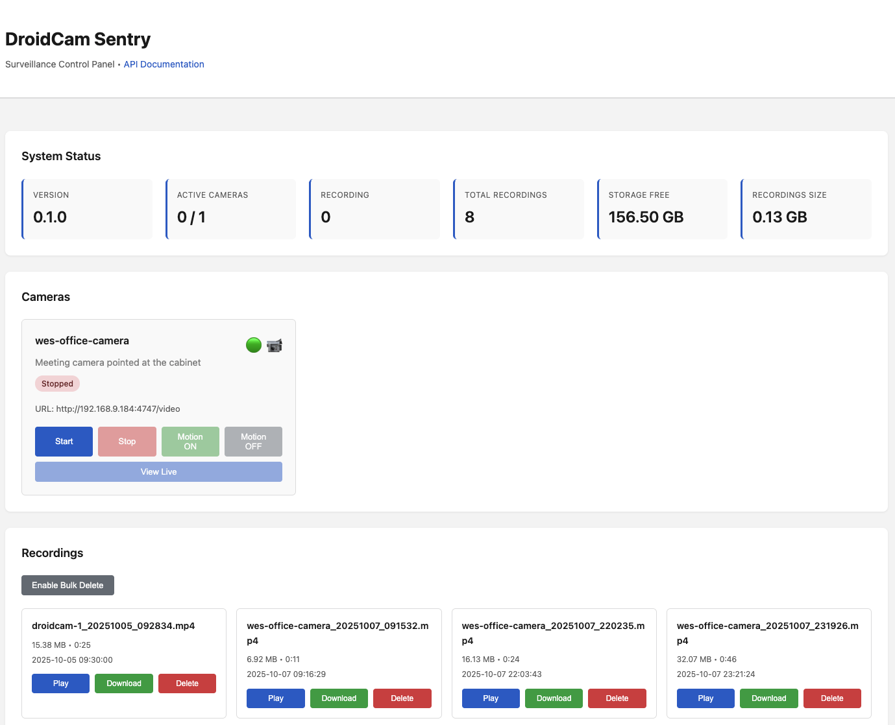

# DroidCam Sentry




[](https://justin.searls.co/shovelware/)  

[](https://github.com/kai5263499/droidcam-sentry/actions/workflows/lint.yml)

[](https://codecov.io/gh/kai5263499/droidcam-sentry)

A motion-activated surveillance system that transforms old smartphones into intelligent security cameras using [DroidCam](https://www.droidcam.app/). This project enables a cost-effective home security solution by repurposing unused Android and iPhone devices.

## Why This Exists

Instead of buying expensive IP cameras, DroidCam Sentry lets you deploy a complete surveillance system using smartphones you already own. With [DroidCam](https://www.droidcam.app/) installed on your old phones, this system provides:

- **Zero Hardware Cost** - Reuse old Android or iPhone devices
- **Professional Features** - Motion detection, pre/post buffering, live streaming
- **Centralized Management** - Web-based control panel for all cameras
- **Automatic Recording** - Only captures footage when motion is detected

Perfect for home security, pet monitoring, or keeping an eye on your property without the expense of commercial surveillance systems.

## Overview

DroidCam Sentry is a Go-based surveillance platform that monitors video streams from [DroidCam](https://www.droidcam.app/) for motion, automatically records events with pre/post buffering, and provides a modern web interface for camera management and playback.

## Quick Start

```bash
# Navigate to project
cd droidcam-sentry

# Build application
make build

# Start server
make start

# Access web UI
open http://localhost:8080
```

## Key Features

- **Multi-camera monitoring** - Control multiple smartphones simultaneously
- **Motion detection** - Configurable sensitivity and threshold settings
- **Smart recording** - Pre/post buffering captures context around events
- **Live streaming** - View real-time MJPEG video in your browser
- **Modern web UI** - Dark theme, responsive design
- **Bulk management** - Select and delete multiple recordings
- **Auto-conversion** - Records to AVI, converts to MP4 automatically
- **Storage tracking** - Monitor disk usage and recording sizes
- **RESTful API** - Full Swagger documentation

## Configuration

Edit `config.yaml`:

```yaml
server:
  host: "0.0.0.0"
  port: 8080

cameras:
  - name: "front-door"
    description: "Main entrance camera"
    url: "http://192.168.1.100:4747/video"  # DroidCam video stream URL
    enabled: true
    motion_threshold: 0.03
    recording:
      path: "/var/recordings/front-door"
      format: "mp4"
      pre_buffer_seconds: 5
      post_buffer_seconds: 10

  - name: "backyard"
    description: "Backyard monitoring"
    url: "http://192.168.1.101:4747/video"
    enabled: true
    motion_threshold: 0.03
    recording:
      path: "/var/recordings/backyard"
      format: "mp4"
      pre_buffer_seconds: 5
      post_buffer_seconds: 10

motion:
  detection_interval_ms: 500
  min_area: 5000

storage:
  max_recording_size_mb: 500
  retention_days: 30
```

## Setting Up DroidCam

1. Install [DroidCam](https://www.droidcam.app/) on your old Android or iPhone
2. Connect the phone to your WiFi network
3. Launch DroidCam app and note the IP address shown
4. Add the camera to `config.yaml` using format: `http://<phone-ip>:4747/video`
5. Mount or position your phone for optimal camera coverage

**Tip:** Use a phone mount or tripod for stable positioning. Keep phones plugged in for continuous operation.

## Architecture

**Backend:** Go with GoCV (OpenCV), FFmpeg conversion, MJPEG broadcasting  
**Frontend:** Vanilla JavaScript, real-time updates  
**Storage:** MP4 recordings with automatic cleanup

See [full documentation](backend/README.md) for detailed API reference, troubleshooting, and development guide.

## API Documentation

Interactive Swagger UI available at: `http://localhost:8080/swagger/index.html`

## System Requirements

- Go 1.21+
- OpenCV 4.x
- FFmpeg
- Linux (Ubuntu 22.04 tested) or macOS

## License

Private project for personal security research and development.
